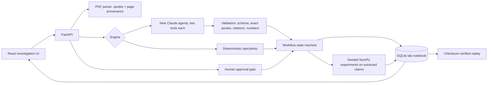

# Contradiction Lab

**Upload two research papers. Watch nine agents work out whether — and why — they disagree.**

**Papers → Evidence → Contradiction → Hypotheses → Experiment → Result → Critique → Next decision**

Contradiction Lab reads two user-supplied PDFs in full, quotes the claims where they conflict with page-level provenance, registers competing explanations, ranks two computational tests, waits for human approval, runs real Python computation, has a critic attack the result, and chooses the next experiment from what survived.

Built for Databricks × Hack-Nation — Agentic Scientific Discovery.

## What works

- **Any two papers.** `#/compare` (`POST /api/papers`) parses each PDF's full text: title, authors, year, journal, DOI, sections, sample size, and claim sentences with exact quotes and page/section provenance. Unknown fields stay null; scanned, image-only and malformed PDFs fail with an explicit message.
- **Honest relationship classes.** Claims are aligned and the pair is classified as a direct contradiction, context-dependent disagreement, complementary findings, insufficiently comparable, or no meaningful contradiction. **If the papers do not meaningfully disagree, the app says so and refuses to start an investigation.**
- **Live Claude agents (verified).** With `ANTHROPIC_API_KEY` set, each of the nine specialists runs on the Claude API (`claude-opus-5-5`) with exactly two tools: read its scoped context and submit one artifact. Every artifact is schema-validated; evidence quotes must appear word for word on the cited page; citations must match the uploaded paper's metadata; numbers must equal the Python results. A rejected artifact is returned to the same agent with the validator's reason (up to three attempts, all logged); nothing is filled in on its behalf. A full live debate on two real journal papers (JAMA 2019 vs BMJ 2020, eggs and cardiovascular disease) has completed and verified.
- **Deterministic mode.** `AGENT_MODE=deterministic` runs the same nine-stage workflow with rule-based specialists, labelled **not an LLM** throughout.
- **Verified replay.** Completed runs are sealed with SHA-256 and replay without recomputation. A first launch seeds a sample debate on two bundled caffeine papers (`data/verified-run.json`).


## Run locally

Python 3.11+ and Node 20.19+ / 22.12+.

```bash
uv venv --python 3.12 .venv
uv pip install --python .venv/bin/python -r requirements.txt
# without uv: python3.12 -m venv .venv && .venv/bin/python -m pip install -r requirements.txt
(cd frontend && npm ci && npm run build)
.venv/bin/python scripts/run.py
```

Windows: use `.venv\Scripts\python` and `npm.cmd`.

Open **http://127.0.0.1:8000** and click **Compare two papers**. Upload Paper A and Paper B, click **Analyze papers**, then **Start the investigation**. The **Arena** plays the specialists' handoffs back exchange by exchange and pauses at your seat for approval. Approve the experiment and watch the Critic attack the result while Analysis answers each challenge with a computed number. The left panel also has **Data** (parsed papers and quotes), **Research graph** and **Record** (raw events, export). **Replay verified run** replays the sealed record.

For frontend development, leave the API running and run `npm run dev` in `frontend`; Vite proxies `/api` to port 8000. API documentation: http://127.0.0.1:8000/docs.

## Configuration

Put settings in `.env` (gitignored). **No key is needed for deterministic mode.**

| Variable | Default / purpose |
|---|---|
| `AGENT_MODE` | `model` (live agents) or `deterministic` (rule-based, no LLM) |
| `ANTHROPIC_API_KEY` | Enables live model agents on the Claude API |
| `CLAUDE_MODEL` | `claude-opus-5-5` |
| `CLAUDE_EFFORT` | `medium`; Claude effort level (`low` … `max`) |
| `OPENAI_API_KEY` | Legacy: used only when `ANTHROPIC_API_KEY` is unset, through the Omnigent openai-agents harness |
| `OMNIGENT_MODEL` | `gpt-4.1-mini`; model for the legacy OpenAI path |
| `LAB_HOST` / `LAB_PORT` | `127.0.0.1` / `8000` |
| `LAB_DB` | `artifacts/lab.sqlite3`; persistent research record |

A live debate on two long papers costs roughly $1.50 in Claude usage and takes about 15 minutes; prompt caching keeps the papers' text from being re-billed on every turn.

## Deploy

Databricks Apps: `app.yaml`, a root build script and `scripts/deploy_databricks.sh` (key stored as a Databricks secret). See [Deploy to Databricks Apps](docs/DEPLOY_DATABRICKS.md).

## Architecture



| Specialist | Owned decision / output |
|---|---|
| LiteratureAgent | Quote the key findings from both papers, with page, section and citation |
| ContradictionAgent | Decide whether the claims are comparable and how they conflict; may stop the run |
| HypothesisAgent | Three competing explanations with predictions and falsification criteria |
| ExperimentPlanner | Score two allowlisted tests; explain the selection and await approval |
| ExperimentRunner | Execute the approved test; record hashes, parameters and results |
| AnalysisAgent | Interpret the computed result; update heuristic support |
| CriticAgent | Attack the result; each challenge is rebutted, stands or stays open on a computed number |
| DecisionAgent | Choose the next experiment from the surviving evidence |
| SafetyAgent | Validate provenance, approval and lineage before sealing |

A backend state machine owns every handoff: agents cannot skip a stage, approve an experiment, or run arbitrary code. Numerical results always come from Python.

## The scientific method

Two allowlisted experiments run on the claims extracted from the two papers: a **claim-alignment robustness audit** (seeded bootstrap resampling of the claims plus section-exclusion sensitivity) and a **condition scan**. They measure whether the detected disagreement is stable, not which paper is right. The critic's last challenge — *no shared primary dataset was analysed* — therefore stays open by design, and the decision proposes the comparison that would settle it. Support scores are a disclosed heuristic, not probabilities. Details: [Scientific method](docs/SCIENTIFIC_METHOD.md).

**Discovery acceleration (measured, no invented multiplier).** The Next-move stage shows counts and timings from the run's own events — hypotheses registered, experiments compared, agent handoffs, approvals, challenges raised / rebutted / open, and question→spec, compute and result→decision times. No manual baseline was measured, so no speed-up is claimed.

## Tests and verification

```bash
.venv/bin/python -m pytest -q
.venv/bin/ruff check backend experiments scripts tests
cd frontend && npm run typecheck && npm run build
# Browser tests need the app running on port 8000, ideally on a scratch database:
#   AGENT_MODE=deterministic LAB_DB=/tmp/e2e.sqlite3 .venv/bin/python scripts/run.py
npx playwright install chromium && npm test
```

Backend tests cover parsing and provenance, relationship classes, refusal to fabricate investigations, the approval gate and handoff order, lineage and tamper detection, model-agent validators, and the Claude provider (against a scripted fake client — not counted as live execution). Browser tests cover upload → analysis → full debate → critic → decision → verified replay, the no-contradiction and malformed-PDF paths, and text-overflow audits at desktop and mobile widths.

## Documentation

- [Architecture](docs/ARCHITECTURE.md)
- [Scientific method](docs/SCIENTIFIC_METHOD.md)
- [Data provenance](docs/DATA_PROVENANCE.md)
- [Demo script](docs/DEMO_SCRIPT.md)
- [Omnigent integration](docs/OMNIGENT.md)
- [Deploy to Databricks Apps](docs/DEPLOY_DATABRICKS.md)
- [Responsible AI](docs/RESPONSIBLE_AI.md)

Limits: extraction is rule-based, so claims phrased without directional language can be missed; comparability starts from term overlap; two-column PDFs parse less cleanly than single-column ones (the failure mode is fewer claims, never invented ones). There is no built-in authentication — keep public deployments behind a login.
