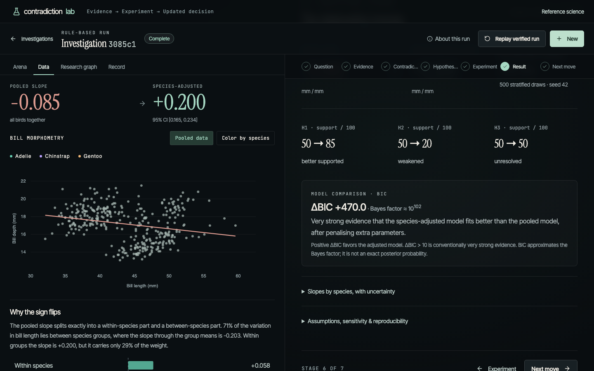
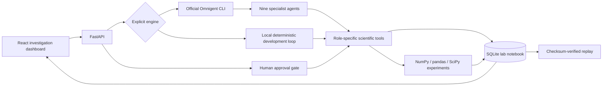

# Contradiction Lab

**Turn scientific disagreement into the next experiment.**

**Question → Evidence → Hypothesis → Experiment → Result → Updated Decision**

A working scientific investigation application: compare cited findings, register competing explanations, rank two computational experiments, obtain human approval, run real Python analysis, quantify uncertainty, and change the next research decision from the observed result.

Built for Databricks × Hack-Nation — Agentic Scientific Discovery.

## What works, and what is credential-dependent

- **Local development:** complete, tested discovery loop on a real open dataset. Deterministic specialist functions, explicitly labeled **not Omnigent and not an LLM**.
- **Omnigent live:** official `omnigent==0.16.0` CLI orchestrates nine declared specialist agents using role-specific function tools. The actual package loads both supplied graphs in tests. A model-backed end-to-end execution **has not been verified** because no model credentials were supplied. This remains a submission acceptance dependency, not a claim of sponsor compliance already achieved.
- **Verified replay:** checksum-validated records of completed real computation. A portable local run ships in `data/verified-run.json`; replay retains its original engine label. Never presented as a live run.



## The scientific problem

Aggregating scientific measurements can reverse the direction of an association. A literature summary can report both findings without explaining what to test next. Contradiction Lab makes the differing context explicit and executes a discriminating test.

The reference asks: **Why does the relationship between penguin bill length and bill depth reverse when species are separated?** The [primary R Journal article](https://journal.r-project.org/articles/RJ-2022-020/) describes the reversal. Our catalog contains two extracted claims from that one article. This is an **apparent contextual contradiction**, not opposing independent papers and not a new biological discovery.

The [Palmer Penguins dataset](https://allisonhorst.github.io/palmerpenguins/) is real, CC0 data. The application checks the bundled CSV's SHA-256 before each run. Of 344 records, 342 have the required measurements. No synthetic observations are used in the demo.

Three candidate domains were considered before selection:

| Candidate | Computational test | Decision |
|---|---|---|
| Penguin morphometry / aggregation reversal | Species-adjusted regression versus year-adjusted regression | Selected: small real dataset, clear provenance, interpretable sign reversal, seconds of CPU time |
| Climate trend disagreement across time windows | Compare time-window and autocorrelation sensitivity | Deferred: more retrieval and time-series assumptions; less compact demonstration |
| ML benchmark ranking disagreement | Repeated cross-validation across tasks/splits | Deferred: greater compute and dataset/version complexity |

The latter two were feasibility candidates, not literature claims we verified or implemented.

## Run locally

Python 3.12+ and Node 20.19+ / 22.12+ recommended. The verified environment used Python 3.14 and Node 22.19.

```powershell
python -m venv .venv
.venv\Scripts\python -m pip install -r requirements.txt
cd frontend
npm.cmd ci
npm.cmd run build
cd ..
.venv\Scripts\python scripts/run.py
```

macOS / Linux (the macOS system Python is 3.9, which is too old; install 3.12 with `uv` or Homebrew):

```bash
uv venv --python 3.12 .venv
uv pip install --python .venv/bin/python -r requirements.txt
# without uv: python3.12 -m venv .venv && .venv/bin/python -m pip install -r requirements.txt
(cd frontend && npm ci && npm run build)
.venv/bin/python scripts/run.py
```

Open **http://127.0.0.1:8000**. The home page shows the latest debate on the agent floor and your investigations with their slopes and challenge verdicts. Click **Start a debate**: the **Arena** plays the run back exchange by exchange (specialists passing claims, hypotheses and test specs to each other), then pauses at your seat for approval. Approve the experiment and watch the Critic attack the result while Analysis answers each challenge with the computed number. The stage tabs on the right follow the action. The open challenge (sex confounding) becomes the follow-up, which you can approve on **Next move**. The left panel also has **Data** (scatter, slope decomposition), **Research graph** and **Record** (raw events, export). **Replay verified run** replays the sealed record.

The arena is a playback of real recorded events and computed challenge verdicts, paced for reading (1×/2×/4×, skip). Local specialists are rule-based; no dialogue is generated.

In this prepared workspace, dependencies already exist in `.packages` and `frontend/node_modules`; launch directly with `python scripts/run.py`. The launcher recognizes `.packages`. Standard installations should use the virtual environment above. Windows PowerShell execution-policy restrictions are avoided with `npm.cmd` and the venv's Python executable; activation is unnecessary.

For frontend development, leave the API running and run `npm.cmd run dev` in `frontend`; Vite proxies `/api` to port 8000. The production server serves the built frontend and API from the same origin. API documentation: http://127.0.0.1:8000/docs.

## Configuration

Copy `.env.example` to `.env` if needed. **No keys are needed for the local demo.**

| Variable | Default / purpose |
|---|---|
| `LAB_HOST` | `127.0.0.1`; local single-user application |
| `LAB_PORT` | `8000` |
| `LAB_DB` | `artifacts/lab.sqlite3`; persistent research record |
| `OPENAI_API_KEY` | Required only for the supplied Omnigent openai-agents harness |
| `OMNIGENT_MODEL` | `gpt-4.1-mini`; choose an accessible model supporting tools |

The Omnigent integration is open source; Databricks credentials are not required for the supplied configuration. Managed Databricks execution needs separate workspace/model configuration; see [Omnigent setup](docs/OMNIGENT.md). Secrets remain backend-side and are excluded from exports.

## Architecture



| Specialist | Owned decision / output |
|---|---|
| LiteratureAgent | Retrieve two validated curated source claims with citations |
| ContradictionAgent | Check comparable outcomes and distinguish contextual reversal |
| HypothesisAgent | Three competing explanations with predictions and falsification criteria |
| ExperimentPlanner | Score two allowlisted tests; explain selection and await approval |
| ExperimentRunner | Execute approved code; record data/code hashes, parameters and results |
| AnalysisAgent | Evaluate actual intervals and sensitivity; update heuristic support |
| CriticAgent | Attack the result with five challenges (noise, single year, single group, overfitting, sex confounding); each is rebutted, standing or left open by a computed number. Open challenges drive the next experiment |
| DecisionAgent | Select follow-up based on the computed evidence |
| SafetyAgent | Validate citations, approval, lineage and experiment provenance |

The local engine uses explicitly identified reference hypotheses. Omnigent's HypothesisAgent supplies schema-validated generated hypotheses within the same three registered categories. Numerical results and support scoring always come from code. Omnigent owns live agent routing; a backend state machine validates each requested handoff and permission. No agent can approve an experiment or run arbitrary shell/Python through the exposed tools.

## Scientific experiment and decision

The selected experiment fits pooled and species-adjusted linear slopes, computes 500 stratified bootstrap draws with seed 42, reports species-specific slopes, and omits each year in turn. The alternative adjusts for year instead. Charts use persisted measurements and fitted estimates, not generated display data.

The reference gives approximately **−0.085 pooled** versus **+0.200 species-adjusted** mm/mm. The result leads to a proposed follow-up on sex and year within species. If uncertainty spans zero or sensitivity is unstable, the system prioritizes replication. If the reversal criterion fails otherwise, it reconsiders covariates. Tests recompute the experiment on perturbed data and verify that the decision changes.

Support scores are a transparent heuristic, not Bayesian probabilities. Alongside them, every result reports a BIC model comparison (pooled versus adjusted model); the BIC difference approximates twice the log Bayes factor. The species-adjusted model is favoured by ΔBIC ≈ 470; the year-adjusted model is not (ΔBIC ≈ −7).

**Why the sign flips.** Each result includes an exact decomposition of the pooled slope: pooled = w × within-group slope + (1 − w) × between-group slope, where w is the within-group share of bill-length variance. For species: −0.085 = 0.29 × (+0.200) + 0.71 × (−0.203), i.e. +0.058 from within species and −0.143 between species. 71% of bill-length variation lies between species, and species with longer bills have shallower bills, which outweighs the positive within-species relationship. This is the explainability view for these linear models; SHAP would reduce to the same coefficients and is not used. The test is exploratory and observational; it does not establish causation.

**Follow-up cycle.** When the decision proposes it, the user can run the follow-up (species + sex + year regression, 333 birds with recorded sex) under a second, separate approval (`POST /api/investigations/{id}/followup`). Adjusting for sex and year shrinks the within-species slope by about 65% (0.200 → 0.070, 95% CI [0.031, 0.108]) but it stays positive, so H3 is better supported and the next step becomes sex-specific slopes. The follow-up's approval, result and interpretation are included in the replay checksum.

**Live updates.** While a run is in progress the UI listens to a server-sent event stream (`GET /api/investigations/{id}/stream`) and falls back to polling if the stream fails.

## Tests and verification

```powershell
.venv\Scripts\python -m pytest -q --basetemp=test-tmp
.venv\Scripts\python -m ruff check backend experiments scripts tests
.venv\Scripts\python -m pytest -q tests/test_science.py::test_complete_discovery_loop_and_lineage --basetemp=test-tmp-integration
cd frontend
npm.cmd run lint
npm.cmd run typecheck
npm.cmd run build
npx.cmd playwright install chromium
# API/production frontend must be running on port 8000:
npm.cmd test
```

On macOS / Linux use `.venv/bin/python` and plain `npm` / `npx`. Format code with `.venv/bin/ruff format backend experiments scripts tests` and `npm run format` in `frontend`.

The frontend lint script runs TypeScript validation; there is no separate ESLint ruleset. Browser testing covers the dashboard, arena playback, critic challenges, approval, actual results, slope decomposition, changed decision, follow-up, graph provenance, verified replay, and mobile overflow. Screenshots are generated as `docs/redesign-*.png`. Run it against a scratch database (`LAB_DB=/tmp/e2e.sqlite3 python scripts/run.py`) so test runs do not appear in your own workspace.

See [verification report](docs/VERIFICATION.md) for commands actually executed and limitations. Test fixtures alone use synthetic counterfactual data or dummy credentials for configuration parsing. No mocked sponsor run is counted as live execution.

## Reproducibility and measured discovery activity

`python scripts/seed_verified_run.py` executes a real local run and writes the portable replay. The script's approval is explicitly identified as developer-authorized automation, not a UI click. The production launcher imports that record only when the database is empty.

Each run records two evidence claims, three hypotheses, two candidates, time to experiment specification, CPU analysis wall time, result-to-decision time, total wall time, seed, data/code hashes and numerical-library versions. The UI displays measured values from the selected run. There is **no invented speedup or unmeasured human-time baseline**.

## Documentation and submission

- [Architecture](docs/ARCHITECTURE.md)
- [Omnigent integration and verification](docs/OMNIGENT.md)
- [Scientific method and score rubric](docs/SCIENTIFIC_METHOD.md)
- [Data provenance](docs/DATA_PROVENANCE.md)
- [Two-minute demo script](docs/DEMO_SCRIPT.md)
- [Responsible AI](docs/RESPONSIBLE_AI.md)

The initial repository was empty: no infrastructure, tests, datasets, credentials interface or sponsor configuration existed. React/Vite + FastAPI were chosen for a responsive scientific UI and typed Python computation, with SQLite keeping deployment simple. No existing work was replaced.

Future work: verify live sponsor execution with credentials; independent datasets and literature retrieval APIs; held-out validation; generalising the pipeline beyond one dataset (CSV upload with user-chosen outcome, predictor and grouping columns); stronger semantic checks on generated hypotheses; authenticated multi-user deployment. This prototype is intended for local trusted use and should not be exposed publicly without authentication and deployment hardening.
