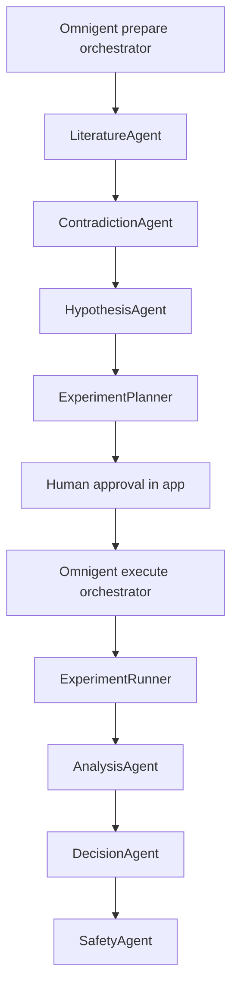

# Omnigent integration

## Verification boundary

The project uses the official [omnigent-ai/omnigent](https://github.com/omnigent-ai/omnigent) package, pinned at **0.16.0**. It does not use the unrelated similarly named frameworks. The installed package's `load_agent_def` accepts both phase configurations in a real SDK test. The official CLI's supported headless `run ... -p ...` invocation was inspected locally.

**A live provider-backed Omnigent run has not been completed in this workspace. No credentials were supplied.** YAML parsing and the local scientific integration test do not establish full sponsor compliance. Judges should see live mode only after the credentialed acceptance steps below succeed.

Official references: [Agent YAML specification](https://github.com/omnigent-ai/omnigent/blob/main/docs/AGENT_YAML_SPEC.md), [Databricks Omnigent documentation](https://docs.databricks.com/aws/en/omnigent/), [Databricks quickstart](https://docs.databricks.com/aws/en/omnigent/quickstart). `omnigent-upstream-spec.md` is the upstream reference snapshot inspected during implementation; it is not application configuration.

## Install and configure

```powershell
.venv\Scripts\python -m pip install -r requirements.txt
Copy-Item .env.example .env
```

Set `OPENAI_API_KEY` and optionally `OMNIGENT_MODEL` in `.env`. Restart `scripts/run.py`. The supplied graph uses the official `openai-agents` harness and direct provider authentication. Omnigent 0.16.0 is required by the adapter to avoid silently running unvalidated interfaces. SDK and model compatibility still need a live smoke test with the operator's account.

In the application select **New investigation → Execution engine → Omnigent**. The engine is selectable when the package and key exist; readiness means configured, not provider authentication verified. A failure is visible and never automatically replaced with the local engine.

The API's sponsor invocation is equivalent to:

```powershell
# For manual debugging only; normally the backend supplies the active ID and environment.
$env:LAB_ACTIVE_INVESTIGATION = '<existing investigation ID>'
$env:OMNIGENT_MODEL = 'gpt-4.1-mini'
python -m omnigent run omnigent_config/prepare.yaml --model $env:OMNIGENT_MODEL --no-log -p 'Dispatch the preparation specialists and stop at the approval gate.'
```

Use the app for the full lifecycle. It provides the proper mode, phase, state and approval. Calling execution tools without an approved record fails.

## Native agent graph



The two actual YAML graphs are `omnigent_config/prepare.yaml` and `execute.yaml`. They use native `type: agent` tools and `type: function` scientific tools. JSON syntax is used because it is valid YAML. Generate them with `python scripts/generate_agents.py`.

Omnigent dispatches the specialists, passes their structured outputs and handles provider tool execution. The backend independently enforces stage order and shared-state permissions. That deterministic safety boundary does not claim to be an alternate sponsor orchestrator.

| Agent | Allowed function | Input contract | Output / handoff |
|---|---|---|---|
| LiteratureAgent | `literature` | Active record + concise rationale | Evidence → ContradictionAgent |
| ContradictionAgent | `contradiction` | Two comparable Evidence objects | Contradiction → HypothesisAgent |
| HypothesisAgent | `hypothesis` | Context + generated JSON array of three Hypothesis objects | Three falsifiable explanations → ExperimentPlanner |
| ExperimentPlanner | `planner` | Hypotheses + validated dataset | Two Experiment proposals and selection → human |
| ExperimentRunner | `runner` | Approved proposal only | Numerical result, runtime metadata → AnalysisAgent |
| AnalysisAgent | `analysis` | Actual Result | Support updates → CriticAgent |
| CriticAgent | `critic` | Result + support updates | Five adversarial challenges, each settled by a computed number (rebutted / stands / open) → DecisionAgent |
| DecisionAgent | `decision` | Result, support updates and open challenges | Result-dependent decision → SafetyAgent |
| SafetyAgent | `safety` | Complete research record | Audit and sealed replay |

Each function is scoped by `LAB_ACTIVE_INVESTIGATION`, supplied to the CLI subprocess by the backend. Function calls return structured object IDs and scientific state, excluding large plot arrays. Each specialist has one mutation capability. There is no shell, filesystem editing, general network, arbitrary Python or approval capability in the declared graphs. The root agent receives only the four allowed sub-agent tools for its phase. The prototype uses sequential execution deliberately; it does not claim parallel hypothesis evaluation.

## Adaptation and rigor

Hypotheses are AI-generated in sponsor mode and schema validated. They remain within registered scientific categories so that the approved experiment and disclosed support rubric retain their meaning. Local mode labels its curated hypotheses separately. Generated wording is not independently semantically proven by schema validation; a human should review the cards before approval.

The numerical runner cannot accept LLM-created metrics. The analysis and next-decision tools evaluate actual intervals, sign reversal and sensitivity outcomes using a transparent rubric. Agents provide short scientific rationales; raw stdout/stderr or private model reasoning are not displayed. The root is instructed to stop after the planner until human approval; code enforces this even if the model ignores that instruction.

## How to verify a live run

1. Configure credentials and select Omnigent explicitly.
2. Confirm the record's `mode` is `omnigent` and the activity log shows official CLI launch.
3. Verify four preparation specialists generated actual object IDs and the app stopped for approval.
4. Approve one candidate; verify the execution specialists create real dataset/code hashes and metrics.
5. Confirm the result-driven decision and completed safety audit.
6. Export JSON. Check `omnigent_receipts`: package version, phase, exit status, config hash and provider-process output digests. Raw provider output is intentionally not exported.
7. Confirm both receipts succeeded and all eight expected specialists appear. A mere installed package or launch event is insufficient evidence.
8. Replay that completed record and confirm it retains the Omnigent engine identity.

The adapter uses a five-minute timeout per phase. Nonzero exit, malformed output, missing handoff or unavailable provider produces an explicit failed record. SDK parsing tests use a dummy key only to resolve configuration variables and make no provider call.

## Managed Databricks alternative

The official framework supports Databricks authentication and model routing. This project ships the direct-provider open-source configuration; managed Databricks is **not tested here**. For managed deployment, follow the linked Databricks quickstart, install `omnigent[databricks]`, configure an accessible workspace/model, and deliberately adapt each executor's auth/model settings and the adapter readiness check. Do not label the existing direct-provider setup as a managed Databricks deployment.
